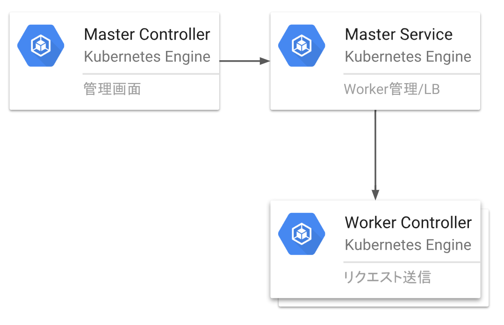

title: Stress Test with Locust on k8s
class: animation-fade
layout: true

<!-- This slide will serve as the base layout for all your slides -->
.bottom-bar[
  
]

---

class: impact

# {{title}}
## PLAID Engineer / Hunter
## 山内 雅浩 @algas

---

# 自己紹介

## 株式会社プレイド
山内 雅浩 [@algas](https://github.com/algas)

- [LinuxKit で実現する新しい Docker 実行環境](https://tech.plaid.co.jp/linuxkit-tutorial/)
- [【KUFU(現SmartHR)×プレイド】Tech Meetup ~Docker編~を開催しました！](https://tech.plaid.co.jp/kufu-docker-meetup/)
- [Haskell on Docker で Portable CLI を作ろう](https://qiita.com/algas/items/fde155abbc9d8ae3f8c9)
- [Whalebrew でコマンドパッケージを作ろう (GNU date を作ってみた)](https://qiita.com/algas/items/66aaf749dc3979e03a46)

---

# 今日の発表内容

- 負荷テストについて
- LOCUSTの紹介
- ローカル環境でLOCUSTを動かす
- クラウド環境(kubernetes)で LOCUST を動かす
- LOCUSTの使用上の注意点

---

# 負荷テストについて

## 負荷テスト (Stress Test)
自社のWebサイトが大量のアクセスに耐えられるかどうかを確認するためのテスト

--

## 負荷テストの何が難しいのか？
- 負荷をかける方にも十分な性能がないと適切な量の負荷をかけることができない
- 複数台のインスタンスが連携してテスト先にアクセスできるのが望ましい
- ネットワークやプロセス(ポート)がボトルネックになりやすい

---

class: locust

# [LOCUST](https://locust.io) の紹介


```python
from locust import HttpLocust, TaskSet, task

class UserBehavior(TaskSet):
    @task(1)
    def index(self):
        self.client.get("/index.html")

class WebsiteUser(HttpLocust):
    task_set = UserBehavior

```

---

# ローカル環境でLOCUSTを動かす

LOCUST をインストールせずに Docker で動作させる環境を作りました！
https://github.com/algas/locust-example

--

## チュートリアル
--

1. `./web`
--

1. `./locust -f locustfile.py --host http://host.docker.internal:8888`
--

1. http://localhost:8089

---

class: two-columns

# クラウド環境でLOCUSTを動かす

.col-6[
## 構成図

]

.col-6[
## 構築手順
1. kubernetes cloud を作成する
1. master controller をデプロイする
1. master service をデプロイする
1. worker controller をデプロイする
1. (必要があれば) worker 台数を変更する
]

---

class: two-columns

# クラウド環境でLOCUSTを動かす

.col-6[
## Web UI

]

.col-6[
## テストの実行
1. Number of users to simulate
1. Hatch rate
1. "Start swarming"
]

---

# LOCUSTの使用上の注意点

## Number of users は徐々に大きくする

自分の管理外のサーバに大量のリクエストを送るとDOS攻撃とみなされる可能性があります。
アクセス先のサーバのログを見て正しく動作していることを確認してから少しずつ Number of users を大きくしましょう。

## Hatch rate は小さく

Hatch rate の値が大きすぎてリクエストを投げることに失敗することがあります。暖気は大切です！

---

# 発表のまとめ

- LOCUSTを使えば簡単にWebサービスの負荷テストができます。
- ローカルでもクラウドでもテスト実行環境が構築できます。

---

# 最後に宣伝

## 株式会社プレイドでは一緒に未来を作ってくれるエンジニアを募集しています！

https://plaid.co.jp/recruit/engineer.html

---

# Appendix

## 負荷テストツールの比較
